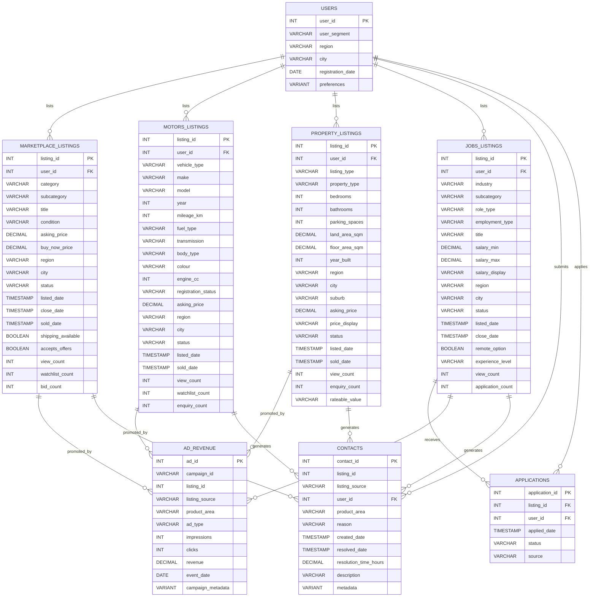

# Plan: Workshop Data Setup (Revised — 4 Listing Tables)

## Context

Revised per user feedback: instead of a single LISTINGS table with a VARIANT `listing_attributes` column, the model now has 4 separate listing tables — one per product area — each with domain-specific columns. This better reflects Trade Me's actual structure and gives each team exercises against their own table.

A single user can list across multiple product areas (e.g., sell a car on Motors and sell furniture on Marketplace).

## Data Model



**Key design note on CONTACTS and AD\_REVENUE joins:** Since there are 4 listing tables, CONTACTS and AD\_REVENUE use a composite reference: `listing_id` + `listing_source` (one of 'marketplace', 'motors', 'property', 'jobs'). This enables the workshop exercises to demonstrate multi-table JOINs where participants must choose the correct source table.

## Column Details by Listing Type

### MARKETPLACE\_LISTINGS

Based on Trade Me general listings (e.g., mountain bike listing):

| Column              | Type      | Notes                                                         |
| ------------------- | --------- | ------------------------------------------------------------- |
| listing\_id         | INT       | PK                                                            |
| user\_id            | INT       | FK to USERS                                                   |
| category            | VARCHAR   | Top-level: Electronics, Sports, Home & Living, Clothing, etc. |
| subcategory         | VARCHAR   | e.g., "Mountain Bikes", "Laptops", "Sofas"                    |
| title               | VARCHAR   | Free-text listing title                                       |
| condition           | VARCHAR   | New, Used - Like New, Used - Good, Used - Average             |
| asking\_price       | DECIMAL   | Starting/asking price in NZD                                  |
| buy\_now\_price     | DECIMAL   | Nullable — Buy Now price                                      |
| region              | VARCHAR   | NZ region                                                     |
| city                | VARCHAR   | City within region                                            |
| status              | VARCHAR   | active, sold, closed, withdrawn                               |
| listed\_date        | TIMESTAMP | When listed                                                   |
| close\_date         | TIMESTAMP | Auction close or expiry date                                  |
| sold\_date          | TIMESTAMP | Nullable                                                      |
| shipping\_available | BOOLEAN   |                                                               |
| accepts\_offers     | BOOLEAN   |                                                               |
| view\_count         | INT       | Total views                                                   |
| watchlist\_count    | INT       | Number of watchlisters                                        |
| bid\_count          | INT       | Number of bids (0 for Buy Now)                                |

### MOTORS\_LISTINGS

Based on Trade Me Motors (e.g., Mazda RX3 listing):

| Column               | Type      | Notes                                                          |
| -------------------- | --------- | -------------------------------------------------------------- |
| listing\_id          | INT       | PK                                                             |
| user\_id             | INT       | FK to USERS — can be dealer (Business) or private (Individual) |
| vehicle\_type        | VARCHAR   | Car, SUV, Ute, Van, Motorcycle, Boat, Motorhome                |
| make                 | VARCHAR   | Toyota, Mazda, Ford, etc.                                      |
| model                | VARCHAR   | e.g., "RX3", "Corolla", "Ranger"                               |
| year                 | INT       | Manufacture year                                               |
| mileage\_km          | INT       | Odometer reading                                               |
| fuel\_type           | VARCHAR   | Petrol, Diesel, Electric, Hybrid, LPG                          |
| transmission         | VARCHAR   | Manual, Automatic, CVT                                         |
| body\_type           | VARCHAR   | Sedan, Hatchback, Wagon, SUV, Coupe, Convertible, Ute          |
| colour               | VARCHAR   |                                                                |
| engine\_cc           | INT       | Engine displacement                                            |
| registration\_status | VARCHAR   | Registered, On Hold, Expired, Imported - Compliance Required   |
| asking\_price        | DECIMAL   | NZD                                                            |
| region               | VARCHAR   |                                                                |
| city                 | VARCHAR   |                                                                |
| status               | VARCHAR   | active, sold, expired, withdrawn                               |
| listed\_date         | TIMESTAMP |                                                                |
| sold\_date           | TIMESTAMP | Nullable                                                       |
| view\_count          | INT       |                                                                |
| watchlist\_count     | INT       |                                                                |
| enquiry\_count       | INT       | Direct enquiries to seller                                     |

### PROPERTY\_LISTINGS

Based on Trade Me Property (e.g., Wellington Breaker Bay house):

| Column           | Type      | Notes                                                        |
| ---------------- | --------- | ------------------------------------------------------------ |
| listing\_id      | INT       | PK                                                           |
| user\_id         | INT       | FK — typically a real estate agent (Business segment)        |
| listing\_type    | VARCHAR   | Sale, Rent, Auction, Tender, Deadline Sale                   |
| property\_type   | VARCHAR   | House, Apartment, Townhouse, Section, Lifestyle, Rural, Unit |
| bedrooms         | INT       |                                                              |
| bathrooms        | INT       |                                                              |
| parking\_spaces  | INT       |                                                              |
| land\_area\_sqm  | DECIMAL   |                                                              |
| floor\_area\_sqm | DECIMAL   |                                                              |
| year\_built      | INT       | Nullable                                                     |
| region           | VARCHAR   |                                                              |
| city             | VARCHAR   |                                                              |
| suburb           | VARCHAR   | e.g., "Breaker Bay", "Ponsonby"                              |
| asking\_price    | DECIMAL   | May be null for "By Negotiation"                             |
| price\_display   | VARCHAR   | "$1,200,000", "By Negotiation", "Tender", "$650pw"           |
| status           | VARCHAR   | active, sold, under\_offer, withdrawn, expired               |
| listed\_date     | TIMESTAMP |                                                              |
| sold\_date       | TIMESTAMP | Nullable                                                     |
| view\_count      | INT       |                                                              |
| enquiry\_count   | INT       |                                                              |
| rateable\_value  | VARCHAR   | Council RV, e.g., "$980,000"                                 |

### JOBS\_LISTINGS

Based on Trade Me Jobs (e.g., Management Accountant in Christchurch):

| Column             | Type      | Notes                                                  |
| ------------------ | --------- | ------------------------------------------------------ |
| listing\_id        | INT       | PK                                                     |
| user\_id           | INT       | FK — employer or recruiter                             |
| industry           | VARCHAR   | Accounting, Technology, Healthcare, Construction, etc. |
| subcategory        | VARCHAR   | e.g., "Management Accountants", "Software Engineers"   |
| role\_type         | VARCHAR   | Permanent, Contract, Temporary                         |
| employment\_type   | VARCHAR   | Full Time, Part Time, Casual                           |
| title              | VARCHAR   | Job title as listed                                    |
| salary\_min        | DECIMAL   | Nullable (some say "Negotiable")                       |
| salary\_max        | DECIMAL   | Nullable                                               |
| salary\_display    | VARCHAR   | "$80k-$100k", "Negotiable", "$45/hour"                 |
| region             | VARCHAR   |                                                        |
| city               | VARCHAR   |                                                        |
| status             | VARCHAR   | active, closed, filled, expired                        |
| listed\_date       | TIMESTAMP |                                                        |
| close\_date        | TIMESTAMP | Application deadline                                   |
| remote\_option     | BOOLEAN   |                                                        |
| experience\_level  | VARCHAR   | Entry, Mid, Senior, Executive                          |
| view\_count        | INT       |                                                        |
| application\_count | INT       | Denormalised count                                     |

## Data Volumes

| Table                 | Rows   | Time Span                            |
| --------------------- | ------ | ------------------------------------ |
| USERS                 | 10,000 | 3 years of registrations             |
| MARKETPLACE\_LISTINGS | 50,000 | 12 months                            |
| MOTORS\_LISTINGS      | 20,000 | 12 months                            |
| PROPERTY\_LISTINGS    | 15,000 | 12 months                            |
| JOBS\_LISTINGS        | 15,000 | 12 months                            |
| CONTACTS              | 25,000 | 12 months (across all listing types) |
| AD\_REVENUE           | 50,000 | 12 months (daily ad events)          |
| APPLICATIONS          | 30,000 | 12 months (Jobs only)                |

## File Structure

```
setup/
├── 01_create_objects.sql              -- DDL: database, schema, all 8 tables, stage, file format
├── 02_load_data.sql                   -- COPY INTO from internal stage for all tables
└── data_generation/
    ├── requirements.txt               -- faker, pandas, numpy
    ├── config.py                      -- Shared constants: regions, cities, categories, makes, etc.
    ├── generate_users.py              -- 10K users
    ├── generate_marketplace.py        -- 50K marketplace listings
    ├── generate_motors.py             -- 20K motors listings
    ├── generate_property.py           -- 15K property listings
    ├── generate_jobs.py               -- 15K jobs listings
    ├── generate_contacts.py           -- 25K contacts (references all 4 listing tables)
    ├── generate_ad_revenue.py         -- 50K ad events (references all 4 listing tables)
    ├── generate_applications.py       -- 30K applications (references jobs listings)
    ├── generate_all.py                -- Orchestrator: runs all in dependency order
    └── output/                        -- CSV output directory (gitignored)
```

## Implementation Steps

### Step 1: Create `setup/01_create_objects.sql`

```sql
SET DATABASE_NAME = 'TRADEME_WORKSHOP';

CREATE DATABASE IF NOT EXISTS IDENTIFIER($DATABASE_NAME);
USE DATABASE IDENTIFIER($DATABASE_NAME);
CREATE SCHEMA IF NOT EXISTS SAMPLE;
USE SCHEMA SAMPLE;

CREATE OR REPLACE FILE FORMAT csv_format ...;
CREATE OR REPLACE STAGE workshop_data_stage ...;

CREATE OR REPLACE TABLE USERS (...);
CREATE OR REPLACE TABLE MARKETPLACE_LISTINGS (...);
CREATE OR REPLACE TABLE MOTORS_LISTINGS (...);
CREATE OR REPLACE TABLE PROPERTY_LISTINGS (...);
CREATE OR REPLACE TABLE JOBS_LISTINGS (...);
CREATE OR REPLACE TABLE CONTACTS (...);
CREATE OR REPLACE TABLE AD_REVENUE (...);
CREATE OR REPLACE TABLE APPLICATIONS (...);
```

Tables include column comments for data catalog discoverability.

### Step 2: Create `config.py`

Shared constants used by all generators:

- NZ regions + cities (with population-based weighting)
- Marketplace categories and subcategories
- Motors makes/models/body types
- Property types, suburbs per city
- Job industries and subcategories
- User segments and their distribution
- Date range (12 months ending today)

### Step 3: Create `generate_users.py`

10,000 users with:

- Segment distribution: Individual (70%), Business (20%), Power Seller (10%)
- Region weighted by NZ population
- Registration dates spread over 3 years
- VARIANT `preferences` JSON column

### Step 4: Create listing generators (4 files)

Each generator:

- References valid `user_id` values from the USERS CSV
- Applies realistic distribution patterns (seasonal, regional)
- Generates domain-specific columns per the table schemas above
- Business users are more likely to have Motors (dealers) and Property (agents) listings
- View counts, watchlist counts etc. correlated with listing age and price

### Step 5: Create supporting table generators

- **CONTACTS**: References listing\_id + listing\_source across all 4 listing tables. Reason distribution varies by product area (Motors = more fraud/scam reports; Property = more billing issues).
- **AD\_REVENUE**: References listing\_id + listing\_source. Higher-value listings more likely to be promoted. Realistic CTR (1-5%) and daily revenue events.
- **APPLICATIONS**: Only references JOBS\_LISTINGS. Zipf distribution (most jobs get 1-5 apps, some get 20+).

### Step 6: Create `generate_all.py` and `02_load_data.sql`

Orchestrator runs generators in order: users -> 4 listing tables -> contacts, ad\_revenue, applications.

Load script uses COPY INTO with correct column ordering and handles the VARIANT columns (auto-parsed from JSON strings in CSV).

## Verification

1. `python setup/data_generation/generate_all.py` produces 8 CSV files
2. Row counts match targets
3. All user\_id FKs in listing tables exist in users.csv
4. All listing\_id references in contacts/ad\_revenue/applications exist in the correct listing table
5. Run DDL and load scripts in Snowflake
6. Execute sample queries from workshop exercises (Module 2c prompts) to verify meaningful results

## Critical Files

- `setup/01_create_objects.sql` -- All DDL with DATABASE\_NAME variable, 8 tables
- `setup/data_generation/config.py` -- NZ-specific reference data and shared constants
- `setup/data_generation/generate_motors.py` -- Complex domain columns (make/model/year/engine)
- `setup/data_generation/generate_contacts.py` -- Must reference all 4 listing tables via listing\_source
- `setup/data_generation/generate_all.py` -- Orchestrator with dependency order and validation
