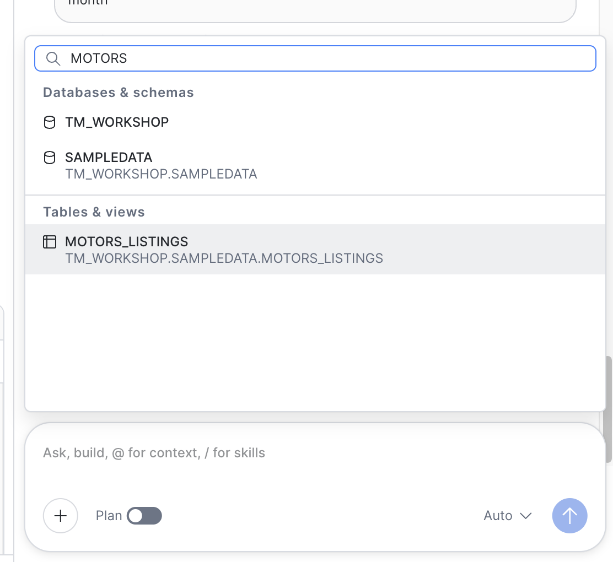
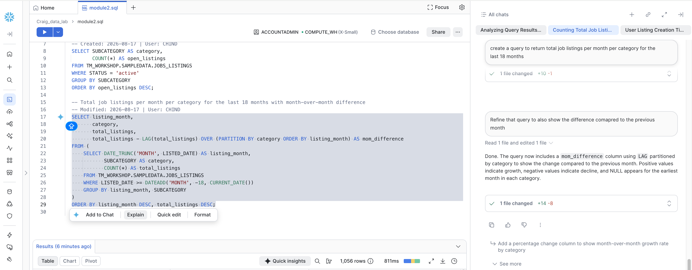

# Trade Me Data Seekers Workshop

## Overview

This workshop is designed to introduce to CoCo - Snowflakes AI coding assistant. during the workshop you will:

1. Navigate Snowflake and understand where Trade Me's data lives
2. Use CoCo to write and iterate on SQL queries without needing to be a SQL expert
3. Create a re-usable CoCo skill to help create a repeatable analysis
4. Build a simple Streamlit app to turn a recurring question into a team-accessible tool

---

## Table of Contents

| Module | Overview |
|--------|----------|
| [Module 1 — Workspaces: Your Personal Data Lab](#module-1--workspaces--your-personal-data-lab) | Set up a personal workspace, run your first SQL query, and explore the results pane for charting, pivoting, and exporting data. |
| [Module 2 — From Question to Answer: AI-Assisted SQL with CoCo](#module-2--from-question-to-answer-ai-assisted-sql-with-coco) | Use plain English prompts to generate SQL queries, iterate and refine them, and tackle advanced multi-join analysis with CoCo. |
| [Module 3 — Advanced Analysis and Creating Re-usable Skills](#module-3---advanced-analysis-and-creating-re-usable-skills) | Build a multi-step analysis, generate a standalone HTML report, and package it all as a reusable CoCo skill. |
| [Module 4 — Team-Ready Tools: Building a Streamlit App with CoCo](#module-4--team-ready-tools-building-a-streamlit-app-with-coco-50-min) | Scaffold and deploy a multi-page Streamlit app that turns recurring questions into a self-service tool for the team. |

---

## Workshop Flow


### Module 1 — Workspaces : Your Personal Data Lab

**Learning Objective:** Set up and use a personal workspace, understand the workspace types available (personal, shared, git-backed), organise files for future reuse, and using the result pane for simple analysis.

**Flow:**

📗 **Exercise 1a — Create Your Workspace and run a SQL query:**
1. Validate your are using the **ANALYST** role by checking in the bottom left hand corner. ( It should show your use name and the **ANALYST** role)
   1. Select **Projects** then **Workspaces** from the left hand menu.
   2. Click the + icon at the top of the workspaces panel and select **Private Workspace**. Name your workspace:  `<your_name>_data_lab`. 
   3. Create a new SQL file inside your Workspace by clicking the **+ Add New** button and selecting **SQL file**
   4. Name the file : **Module1.sql**.  You will now have an empty worksheet ready to write some SQL. 
   5. Before we get started we need to set which database and schema we want to work with. to do this: \
   5.1 In the top right hand corner of the worksheet click the database icon\
   5.2  Select **ANALYTICS** from **Databases** list\
   5.3  Select **SANDBOX** from the **Schemas** list

      See the screen shot below for an example:\
      

   5.4 Tot he left of the database name make sure your **ROLE** and **WAREHOUSE** are set correctly. They should be:
      **ROLE:** ANALYST
      **WAREHOUSE:** ANALYSER
   6. Copy and paste this query into the worksheet and run the query by clicking the blue **Run** button in the top left hand of the worksheet.
   
      ```
      select * from workshop__jobs_listings limit 500;
      ```
  
      > **NOTE: if the query does not return any results, or you get an error, you may not have set the database and schema correctly.** 

📗 **Optional- Explore the results tab:**
 
   The results tab is where you can view, and work with, the results of a query.  
   
   ---

   **Table view** - Shows tabular results. It shows a profile of the data in each column. This can be toggled on and off by clicking the **Show Column Stats** icon ( The little graph in the top left cell of the results). You can also search within the results set, show / hide columns, access the query plan, and download the results as a CSV. 
   1. Click the **Search** icon in the results pane and search for "Legal". Note how it filters the results. Clear the search box by clicking the X icon in the search box.
   2. Click the **Column Selection** icon. Untick the MEMBER_ID column and click the **Apply** button at the bottom of the list. Note how the column is removed from the results set. 
   3. Click the **Download** icon. This allows you to download the results set as a CSV file. 
   
   ---

   **Chart view** - This allows you to create basic charts directly from the results set. Its great for quickly visualising the results.

   1. Click the **Chart** button then select **Bar Chart** from the Chart Type drop down. 
   2. Select **INDUSTRY** as the x-axis column
   3. Select **LISTING_ID** as the Y-axis column. 
   4. Change the Aggregate to **COUNT**.
   5. Change the Group by to **ROLE_TYPE**
   
   ---

   **Pivot view** - This allows you to create a pivot table directly from the results set.
   1. Click the **Add row Fields** box and select the **INDUSTRY** column
   2. Click the **Add column Fields** box and select the **ROLE_TYPE** column
   3. Click the **Add value Fields** box and select **LISTING_ID**. 
   4. Change the **Aggregation** to **COUNT**


**Wrap-up** A private workspace is a space for you to write queries and code, build apps, and more. You can manage your files using folders; you can upload files and folders; and you can manage file versions.

**Module 1 Snowflake Skills / Features:**

✅ Snowflake Workspaces (personal workspace — hands-on; shared and git-backed — concept awareness)\
✅ Workspace file management\
✅ Working with the Results pane for simple analysis, charting, and pivot tables


---

### Module 2 — From Question to Answer: AI-Assisted SQL with CoCo

**Learning Objective:** Use Cortex Code (CoCo) to write, refine, and understand SQL queries — starting from plain English and building up to multi-step analysis — without needing to be a SQL expert.


**Flow:**

📗  **Exercise 2a — Simple Query from Plain English**
   
   1. Click the CoCo tab on the right hand side of teh screen to display the CoCo panel. ( The blue tab with the Star in it)

   3. Copy and paste the following prompt into CoCo and hit enter on your keyboard, or click the blue ***Send** icon in the chat field.

      ``` 
      What tables are in the ANALYTICS.SANDBOX schema that start with WORKSHOP?
      ```
   
      CoCo will run a metadata query to get a list of the tables. Note how CoCo provides some additional data such as Row Count and Description. 

   4. Copy and paste the following prompt into CoCo and hit enter on your keyboard, or click the blue ***Send** icon in the chat field.

      ``` 
      How many job listings are there? 
      ```

      Notice that CoCo just answered the question in the chat window? If you are curious you can see the SQL it generated and ran by clicking the "Expand" icon.  (See screenshot below)

      
   
      You could copy the SQL query and paste it into the worksheet if you wanted to re-use it,or you could be more specific in your prompt. 
   
   5. Copy and paste the following into CoCo. 

      ``` 
      Create a new query that returns how many listings there are?
      ```
      Note this time CoCo adds the query text to the SQL worksheet. Also note how it highlights the changes and provides the option to "Keep" the changes or "Undo" the changes. Click "Keep All". This makes it easy to see what code CoCo has created, deleted or changed in your file.

   6. We actually have multiple "listings" tables in the database - Jobs, Motors, Marketplace, Property. What happens if you quickly want to check Motors listings? You could explicitly mention motors listings in your prompt but you can also provide CoCo with Context to guide it to the right database, schema, table, or view for example. 

   7. Click the **+** icon in the CoCo **chat** box, then type WORKSHOP__MOTORS in the search box. (NOTE there are 2 underscores in the name). The **WORKSHOP__MOTORS_LISTINGS** table should be displayed in the list. Click **WORKSHOP__MOTORS_LISTINGS** result to add this table as context for CoCo.

      

   8. Now copy and paste the following prompt.

      ```
      How many listings are there?
      ```

      Note how CoCo queries the **WORKSHOP__MOTORS_LISTINGS** table. This is because we provided the table as context. Providing context like this is useful when you have access to a lot of databases, schema, and tables. It means CoCo does not need to waste time (and tokens) performing metadata queries to try and figure out what tables it needs to query. 

      💡 **TIP:** Providing context and being specific with your prompts can really help CoCo 💡 


📗  **Exercise 2b — Iterate and Refine:**
   
   Now ask CoCo these questions in turn.  If CoCo changes the SQL in the Worksheet just click "Keep Changes". Make sure each query actually runs by clicking anywhere in the the query, then clicking the blue **Run Query** button.

   1. Copy and paste the following prompt into CoCo:

      ```
      Create a query to show open job listings by category
      ```

      Note how  it creates a new query and includes a WHERE clause thats filters the data on status, and a GROUP BY clause to get the count per category. Remember to click the **Keep All** button to retain the changes. 

   1. Click anywhere in the query then click the blue **Run** button to run the query. Does it return any results?

   1. If it does not return any results it may be that CoCo looked for listings with a status of "Open"  ( because thats what we asked for)

   1. Highlight the query with your mouse, and click the **Add to Chat** button, then type the following prompt into CoCo:

      ```
      this returns no results
      ```

      


      CoCo will use the query as context for your question and it will attempt to diagnose and fix the query. It should determine that "Open" is not a valid status and modify the query to use "Active" instead. Click **Keep Changes** and then re-run the query.

   2. Copy and paste the following prompt into CoCo:

      ```
      Create a query to return total job listings per month per category for the last 18 months
      ```
      Note how the SQL gets a bit more complicated. You may see DATE functions being used along with filters in the WHERE clause and grouping via the GROUP BY clause. 

   1. Click anywhere in the query then click the blue **Run** button to run the query.

   3. Copy and paste the following prompt into CoCo:
      ```
      Refine that query to also show the difference compared to the previous month
      ```
      Note that it modified the last query it created even though you only said "refine that query...". You will notice the SQL query might now include a sub-query and some different functions. Don't forget to click **Keep Changes** 

   4.  Now with your mouse **highlight** the query and then select **Explain** form the menu that pops up. CoCo will then explain what the query is doing. This is great for understanding SQL that CoCo generates or if you are using SQL written by someone else. 

   


📗 **Exercise 2c — Advanced Query: Multi-Join, CTEs, Aggregation, and JSON**

   Lets ask CoCo to build a more complex query that may mirror the kind of question an analyst would normally tackle.

   1. Copy and paste the following prompt into CoCo:
      ```
      Create a new query that returns: 
      
      The number of "Contacts" by reason, for each of the last 3 months , that required escalation and how that compares to the same months last year, and against  the monthly average from the previous 12 months
      ```

      Review both the response that CoCo provides in the chat after creating the query and the query itself. Notice how CoCo provides a explanation of the query it just created especially the logic / business rules it applied.  

**Wrap-up** CoCo is great for creating and modifying SQL queries against your Snowflake data. It knows Snowflake, it knows SQL, and it has hte context about you data it needs to create the queries. 

**Module 2 Snowflake Skills / Features:**

✅ Workspaces "diff" feature to see what additions, deletions, and changes CoCo makes to your queries\
✅ Leveraging CoCo to write simple and advanced SQL queries.\
✅ Understanding that you can provide CoCo with "context" which could be a table, or an entire schema or database.\
✅ Leveraging CoCo to help you understand what a SQL query is in plain language. 

### Module 3 - Advanced Analysis and creating re-usable skills:

📗 **Exercise 3a — Building a multi-step Analysis**

   Often you may have the need to produce some insight that may need multiple queries to produce the data you need. You could build these up 1 at a time but we can also get CoCo to accelerate this kind of analysis. You can even use CoCo to help identify and refine the requirements. 


   1. Add a new  **SQL file** to your workspace and rename it: **marketplace_performance.sql**

   1.  In the top right hand corner of the worksheet click the database icon, Select **ANALYTICS** from **Databases** list then select **SANDBOX** from the **Schemas** list

   2. Create a new CoCo session by clicking the **+** icon at the **Top** of the CoCo pane. This will give a new chat window with no history

      💡 **TIP:**  Managing session context is really important. The context window has limited space so when you start a new task or job, it pays to create a new session. You can have multiple sessions going at once if you need to perform multiple tasks. To see all chats click **All Chats** at the top of the CoCo window.💡
   
   3. In the CoCo panel toggle the **Plan** switch to the **on** position. Planning allows CoCo to think about how it will solve a problem and present a plan that you can review before it writes any code. This is a really useful step especially for more complex tasks.

   4. Copy and paste the following prompt into CoCo.

      ```
      I need to design the Head of Marketplace ( who owns Marketing place listings) with an analysis of Monthly Marketplace listing performance that they can review each month at their leadership team meeting. 
      
      Some of the insights they want includes: 
      
      Number of new listings created in last 7 days, 14 day, 30 days, year to date.
      Number of new listings created in last 7 days, 14 day, 30 days, year to date compared with the same periods the previous year 
      Top 5 and bottom 5 Listing categories by increase or decrease last month vs the month before
      Sold vs unsold listing count and percentage by Region 
      Contacts by members that relate to marketplace listings 
      
      Also Review the tables in the SANDBOX schema and make suggestions on other insights that might be relevant to the Head of marketplace listings. Ask me any relevant clarification questions .
      ```
      💡 **TIP:** Prompting CoCO to ask clarification questions is a great way too help ensure CoCO gets all the information it might need. 💡


      Note CoCo may ask you some questions. These may include:

      - Clarifying if you only want to include listings from the marketplace_listings table - Answer "Marketplace Listings" only.
      - Clarifying what "Category" column you want to use as there are category and sub category fields - Choose the CATEGORY field
      - If you want one query or multiple queries - Choose multiple / separate queries
      - Clarifying the rules for "Sold vs Unsold" - You want any status that is not sold = Unsold. 

      Once CoCo has finished review the plan it came up with. Note that it has outlined the proposed queries it will create. Also note the additional suggested insights. You can leverage CoCo tp help identify other analysis ideas. If you wanted to, you could iterate on the plan with CoCo to get it to the ideal state. 

   5.  Toggle the **Plan** switch to the **off** position.
   
   6. Copy and paste the following prompt into CoCo

      ```
      Proceed with the build. Include all the suggested additional insights. Add a comment to each query explaining what it does. 
      ```
      Once CoCo has finished review the SQL it generated. Do not forget to click **Keep changes** . Note it has created a query for each item in the plan. Some are simple and some are more complex. 

   7. Run 2 or 3 of the queries that CoCo created to make sure they run as expected.

 

📗 **Exercise 3b — Build a HTML report:**


   Now we have the queries to produce the data we need to answer the leadership teams questions, but we need a nicer way to present that data.

   1. Toggle the **Plan** switch to the **On** position.

   2. Copy and paste the following prompt into coco

      ```

      I want to create a one off HTML report that shows the results of SQL queries that can be used in the leadership team meeting. 
      
      My requirements include: 
      The HTML report should be static and standalone 
      The layout should be in a presentation style with one "page" for each analysis and navigation to move forward and back 
      There should be a Title "page" 
      Each section should have a title, and a brief description of what is being shown., and the data/ insight
      Where appropriate use a chart to visualise the data, or a metric/KPI card for single data points. Use a table if appropriate. 
      
      Ask me any relevant clarification questions. Make suggestions on how I could possibly improve the output

      ```

      CoCo may ask you some clarification questions. These may include:

      - Colour Theme - Choose either Light or Dark if you get asked. 
      - Charts library - Choose the **Chart.js** option if you get asked.
      - Branding - Choose "Generic branding" if you get asked.

   3. Review the plan that CoCo proposes. Take note of the suggested improvements to see if they make sense. Normally you may iterate on the plan to get it "just right" but today we will proceed with the build. Copy and paste the following prompt into CoCo:

      ```
      Proceed with the build. Include the suggested improvements. Create all files in the current workspace. 
      ``` 
      > **NOTE: The build may take a few minutes**

   4. Once CoCo has finished you should have a new "HTML" file in your Workspace. Currently you cannot render HTML files in Workspaces so you will need to **Download** the HTML to your laptop to view it. To do this:

      - Click the HTML file in the Workspaces file pane
      - Click the ellipsis ( 3 dots) to the right of the file name
      - Select **Download** from the menu that pops up
      - Once downloaded locate the file on yur laptop and open it in a new browser window.
      - Navigate through the report. 


📗 **Exercise 3c — Build a Reusable CoCo Skill (25 min):**

   You've built a solid multi-step analysis, and generate a HTML report, but this is a statics asset. We need to be able to re-create this each month or when. Now you'll package it as a **CoCo Skill** — a reusable prompt file that lets anyone (including future-you) run this same analysis with a single command.


   1. Toggle the **Plan** switch to the **on** position

   2. Copy and paste the following prompt into CoCo

      ```
      I want to make the report generator a re-usable asset. Help me create a new CoCo skill that will enable me to: Ask the user what month and year they want to run the report for. Default to the previous month. Runs the SQL queries and produce a new HTML file Ensure the file name  includes the Month and year, and a timestamp for report run.
      ```

      Once CoCO has finished review the plan. 

   3. Toggle the **Plan** switch to the **off** position then copy and paste the following prompt into CoCo:

      ```
      Proceed with the build
      ```

      Once CoCo has finished creating your new skill test it out. Don't forget to click the **Keep All** changes button.

   4. In the CoCo chat box type **/marketplace** . You should see your new skill appear in the search results under **Personal Skills**

   

   5. Click the skill so it gets added to the chat window then click the **Send** button on the chat window. ( or hit enter on your keyboard)

      CoC will then load the skill. It should prompt you to enter the Month and Year. Pick **July 2026** and click submit. CoCo will now run the report.

      Once it is complete you should see a new HTML file appear in your workspaces file list. 

 6. Currently you cannot render HTML files in Workspaces so you will need to **Download** the HTML to your laptop to view it. To do this:
    - Click the HTML file in the Workspaces file pane
    - Click the ellipsis ( 3 dots) to the right of the file name
    - Select **Download** from the menu that pops up
    - Once downloaded locate the file on yur laptop and open it in a new browser window.
    - Navigate through the report and check it is correct.


**Wrap-up:** Key message: *CoCo can write SQL that would take an experienced analyst 30 minutes to compose from scratch. Skills let you package that work so it's repeatable with a single command. Your job shifts from writing syntax to asking the right question, verifying the answer, and making it reusable.*

**Snowflake Skills / Features:**

✅ Cortex Code (CoCo) — SQL generation from natural language\
✅ CoCo iterative refinement (follow-up prompts)\
✅ CoCo "explain this code" capability\
✅ Advanced SQL patterns: CTEs, multi-table JOINs, aggregation, JSON/VARIANT field extraction\
✅ Progressive query building — layering complexity iteratively\
✅ Workspaces results pane: column chooser, sorting, chart view and customisation, CSV download\
✅  CoCo Skills — creating, customising, and invoking reusable prompt-based skills\

---


### Module 4 — Team-Ready Tools: Building a Streamlit App with CoCo (Optional if you have time)

**Learning Objective:** Use CoCo to scaffold a simple Streamlit app that turns a recurring business question into a self-service tool any team member can use — without needing to maintain a dashboard or wait for an analyst.

**Flow:**

📗 **Exercise 4a: building a data driven application**

1. Create a new CoCo session by clicking the **+** icon at the **Top** of the CoCo pane. 

   💡 **TIP:** Managing session context is really important. The context window has limited space so when you start a new task or job, it pays to create a new session. You can have multiple sessions going at once. 💡

2. Toggle the **Plan** mode switch to **on**. 

3. Copy and paste the following prompt into CoCo: 
 

   ```
   Build an interactive Streamlit app in a new workspace folder called "marketplace-listings-app" 
   that uses data from ANALYTICS.SANDBOX.WORKSHOP__MARKETPLACE_LISTINGS, ANALYTICS.SANDBOX.WORKSHOP__AD_REVENUE, 
   and ANALYTICS.SANDBOX.WORKSHOP__CONTACTS tables.

   ## App Purpose
   A multi-purpose tool for marketplace listing team members: daily monitoring dashboard, 
   self-service analytics for ad-hoc exploration, and presentation-ready views for leadership meetings.

   ## Structure
   - Sidebar navigation with 4 pages:
   1. Executive Summary — KPI cards with trend sparklines, YoY comparison, goal progress bars, threshold alerts
   2. Listings & Categories — Top/bottom 5 categories by MoM change, sell-through by category, new listings breakdown
   3. Revenue & Engagement — Ad revenue with MoM trends, engagement metrics (views, watchlist, bids) by category, price trends
   4. Operations — Sold vs unsold by region (stacked bar), time-to-sell by region, contact reasons with escalation rates

   ## Global Features (sidebar, persisted across pages)
   - Date window selector: Last 7 days, Last 14 days, Last 30 days, Year to date
   - Category multi-select filter (populated dynamically from data)
   - Region multi-select filter (populated dynamically from data)
   - Comparison toggles on category and revenue pages: Absolute / MoM Change / MoM %
   - Goal tracking: user-configurable monthly new listings target and sell-through rate target, shown as progress bars on Executive Summary

   ## Threshold Alerts (fixed defaults)
   - Sell-through rate: red below 25%, yellow below 35%
   - Escalation rate: red above 20%, yellow above 15%  
   - YoY decline in new listings: yellow warning
   ```

   CoCo may ask you some clarification questions. Answer them as best you can.  Once you have answered the questions CoCo will develop the plan. Once complete review the plan.

   > NOTE: For the purposes of the workshop we have developed a comprehensive prompt. In the real world you could leverage CoCo to help you design the app, then ask it to create a prompt that you can use to generate the app.  Or you could upload a set of requirements, or a mock up even, and ask CoCo to build off that.

4. Now you have reviewed the plan ask coco to build. Copy and paste the following prompt :

   ```
   Proceed with the build.
   ```

   CoCo will built your Stream lit application. It may take a few minutes for the build to complete. Once complete you are ready to test it.

5. You should see a new **marketplace-listings-app** folder in your Workspace. Inside the folder should be a file called **streamlit_app.py**. Click the file to open it. 

   

6. When the file opens you should see a blue **Run** button in the top left hand corner. Click the **Run** button. 

   

7. A new tab should open and your app should load and should look similar to the one below.

   

8.  Navigate your way around the app and check out each page. Try using the filters in the left hand menu to make sure the app


**If you have some spare time you could try the following :**

 - Ask CoCo to re-style the streamlit app using www.trademe.co.nz for inspiration.
 - Ask CoCo to add a marketplace listing sub category filter into the app.
 - 

**Snowflake Skills / Features:**

✅ Leveraging CoCo to build a data driven streamlit app\
✅ Running a Streamlit app locally in your workspace


## CONGRATULATIONS - you have reached the end of the workshop. 

To recap some of the CoCo specific things you learnt today:

- Start a new CoCo session for each distinct task. The context window has limited space, so switching topics without clearing context can lead to confused or lower-quality responses.

- Provide explicit table context rather than relying on CoCo to discover tables. This saves time and tokens, and ensures CoCo queries the correct table when multiple similar ones exist.

- Use Plan mode for complex, multi-step tasks before asking CoCo to build. Reviewing and iterating on a plan first produces better results than jumping straight into code generation.

- Be specific in your prompts about where you want output to go. Saying "create a new query" versus just asking a question determines whether CoCo writes to your worksheet or just answers in chat.

- Use the "Explain" feature on any SQL you don't fully understand. Highlight code and select Explain — this is valuable whether the SQL came from CoCo or from a colleague.

- Skills turn one-off work into repeatable assets. If you find yourself running the same analysis more than once, package it as a CoCo skill so anyone on the team can invoke it with a single command.

- Answer CoCo's clarification questions thoughtfully. The quality of the output depends heavily on how well you define scope, filters, and business rules when CoCo asks for them.

- CoCo can do a lot more than just write code. It can help you understand requirements, design solutions, troubleshoot issues, teach you about Snowflake and much more. 