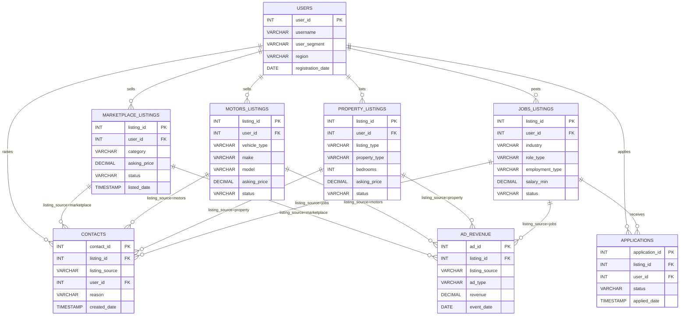

# Trade Me Workshop Data Model

Database: `TM_WORKSHOP` | Schema: `SAMPLEDATA`

## Entity Relationship Diagram

---

## Tables

### USERS

Registered Trade Me users (anonymised).

| Column | Type | Nullable | Description |
|--------|------|----------|-------------|
| user_id | INT | NOT NULL | Primary key |
| username | VARCHAR(200) | NOT NULL | Login username - email or handle |
| first_name | VARCHAR(100) | YES | First name (Individual users only) |
| last_name | VARCHAR(100) | YES | Last name (Individual users only) |
| business_name | VARCHAR(200) | YES | Business name (Business/Power Seller only) |
| user_segment | VARCHAR(50) | NOT NULL | Individual, Business, or Power Seller |
| region | VARCHAR(100) | NOT NULL | NZ region |
| city | VARCHAR(100) | NOT NULL | |
| registration_date | DATE | NOT NULL | |
| preferences | VARIANT | YES | JSON: notification prefs, interests, saved searches |

---

### MARKETPLACE_LISTINGS

General marketplace listings: buy/sell consumer goods.

| Column | Type | Nullable | Description |
|--------|------|----------|-------------|
| listing_id | INT | NOT NULL | Primary key |
| user_id | INT | NOT NULL | FK to USERS |
| category | VARCHAR(100) | NOT NULL | Top-level category |
| subcategory | VARCHAR(100) | NOT NULL | |
| title | VARCHAR(500) | NOT NULL | |
| condition | VARCHAR(50) | NOT NULL | New, Used - Like New, Used - Good, Used - Average |
| asking_price | DECIMAL(12,2) | YES | Starting/asking price NZD |
| buy_now_price | DECIMAL(12,2) | YES | Buy Now price NZD |
| region | VARCHAR(100) | NOT NULL | |
| city | VARCHAR(100) | NOT NULL | |
| status | VARCHAR(50) | NOT NULL | active, sold, closed, withdrawn |
| listed_date | TIMESTAMP_NTZ | NOT NULL | |
| close_date | TIMESTAMP_NTZ | YES | Auction close or expiry |
| sold_date | TIMESTAMP_NTZ | YES | |
| shipping_available | BOOLEAN | NOT NULL | |
| accepts_offers | BOOLEAN | NOT NULL | |
| view_count | INT | NOT NULL | Default 0 |
| watchlist_count | INT | NOT NULL | Default 0 |
| bid_count | INT | NOT NULL | Default 0 |

---

### MOTORS_LISTINGS

Vehicle listings: cars, motorcycles, boats, motorhomes.

| Column | Type | Nullable | Description |
|--------|------|----------|-------------|
| listing_id | INT | NOT NULL | Primary key |
| user_id | INT | NOT NULL | FK to USERS |
| vehicle_type | VARCHAR(50) | NOT NULL | Car, SUV, Ute, Van, Motorcycle, Boat, Motorhome |
| make | VARCHAR(100) | NOT NULL | |
| model | VARCHAR(100) | NOT NULL | |
| year | INT | NOT NULL | |
| mileage_km | INT | YES | Odometer reading |
| fuel_type | VARCHAR(50) | NOT NULL | Petrol, Diesel, Electric, Hybrid, LPG |
| transmission | VARCHAR(50) | NOT NULL | Manual, Automatic, CVT |
| body_type | VARCHAR(50) | NOT NULL | Sedan, Hatchback, Wagon, SUV, Coupe, Convertible, Ute |
| colour | VARCHAR(50) | YES | |
| engine_cc | INT | YES | Engine displacement in cc |
| registration_status | VARCHAR(100) | NOT NULL | Registered, On Hold, Expired, Imported |
| asking_price | DECIMAL(12,2) | NOT NULL | |
| region | VARCHAR(100) | NOT NULL | |
| city | VARCHAR(100) | NOT NULL | |
| status | VARCHAR(50) | NOT NULL | active, sold, expired, withdrawn |
| listed_date | TIMESTAMP_NTZ | NOT NULL | |
| sold_date | TIMESTAMP_NTZ | YES | |
| view_count | INT | NOT NULL | Default 0 |
| watchlist_count | INT | NOT NULL | Default 0 |
| enquiry_count | INT | NOT NULL | Default 0 |

---

### PROPERTY_LISTINGS

Property listings: residential and commercial sale/rent.

| Column | Type | Nullable | Description |
|--------|------|----------|-------------|
| listing_id | INT | NOT NULL | Primary key |
| user_id | INT | NOT NULL | FK to USERS - typically agent (Business) |
| listing_type | VARCHAR(50) | NOT NULL | Sale, Rent, Auction, Tender, Deadline Sale |
| property_type | VARCHAR(50) | NOT NULL | House, Apartment, Townhouse, Section, Lifestyle, Rural, Unit |
| bedrooms | INT | YES | |
| bathrooms | INT | YES | |
| parking_spaces | INT | YES | |
| land_area_sqm | DECIMAL(10,1) | YES | |
| floor_area_sqm | DECIMAL(10,1) | YES | |
| year_built | INT | YES | |
| region | VARCHAR(100) | NOT NULL | |
| city | VARCHAR(100) | NOT NULL | |
| suburb | VARCHAR(100) | YES | |
| asking_price | DECIMAL(14,2) | YES | Nullable for By Negotiation / Tender |
| price_display | VARCHAR(100) | NOT NULL | Display string: $1,200,000 or By Negotiation |
| status | VARCHAR(50) | NOT NULL | active, sold, under_offer, withdrawn, expired |
| listed_date | TIMESTAMP_NTZ | NOT NULL | |
| sold_date | TIMESTAMP_NTZ | YES | |
| view_count | INT | NOT NULL | Default 0 |
| enquiry_count | INT | NOT NULL | Default 0 |
| rateable_value | VARCHAR(50) | YES | Council RV e.g. $980,000 |

---

### JOBS_LISTINGS

Job listings across all industries.

| Column | Type | Nullable | Description |
|--------|------|----------|-------------|
| listing_id | INT | NOT NULL | Primary key |
| user_id | INT | NOT NULL | FK to USERS - employer or recruiter |
| industry | VARCHAR(100) | NOT NULL | |
| subcategory | VARCHAR(100) | NOT NULL | Role subcategory e.g. Management Accountants |
| role_type | VARCHAR(50) | NOT NULL | Permanent, Contract, Temporary |
| employment_type | VARCHAR(50) | NOT NULL | Full Time, Part Time, Casual |
| title | VARCHAR(500) | NOT NULL | Job title as listed |
| salary_min | DECIMAL(12,2) | YES | Nullable if Negotiable |
| salary_max | DECIMAL(12,2) | YES | |
| salary_display | VARCHAR(100) | NOT NULL | $80k-$100k, Negotiable, $45/hour |
| region | VARCHAR(100) | NOT NULL | |
| city | VARCHAR(100) | NOT NULL | |
| status | VARCHAR(50) | NOT NULL | active, closed, filled, expired |
| listed_date | TIMESTAMP_NTZ | NOT NULL | |
| close_date | TIMESTAMP_NTZ | YES | Application deadline |
| remote_option | BOOLEAN | NOT NULL | |
| experience_level | VARCHAR(50) | NOT NULL | Entry, Mid, Senior, Executive |
| view_count | INT | NOT NULL | Default 0 |
| application_count | INT | NOT NULL | Default 0 |

---

### CONTACTS

Customer support contacts linked to listings.

| Column | Type | Nullable | Description |
|--------|------|----------|-------------|
| contact_id | INT | NOT NULL | Primary key |
| listing_id | INT | YES | FK to one of the 4 listing tables |
| listing_source | VARCHAR(50) | YES | marketplace, motors, property, jobs |
| user_id | INT | NOT NULL | FK to USERS - person who raised contact |
| product_area | VARCHAR(50) | NOT NULL | Marketplace, Motors, Property, Jobs |
| reason | VARCHAR(100) | NOT NULL | Billing, Fraud, Technical, Listing Quality, Delivery, Account |
| created_date | TIMESTAMP_NTZ | NOT NULL | |
| resolved_date | TIMESTAMP_NTZ | YES | |
| resolution_time_hours | DECIMAL(8,2) | YES | |
| description | VARCHAR(1000) | YES | |
| metadata | VARIANT | YES | JSON: channel, priority, agent_id, tags, escalated |

---

### AD_REVENUE

Daily advertising revenue events across all product areas.

| Column | Type | Nullable | Description |
|--------|------|----------|-------------|
| ad_id | INT | NOT NULL | Primary key |
| campaign_id | VARCHAR(50) | NOT NULL | |
| listing_id | INT | YES | FK to one of the 4 listing tables |
| listing_source | VARCHAR(50) | YES | marketplace, motors, property, jobs |
| product_area | VARCHAR(50) | NOT NULL | |
| ad_type | VARCHAR(50) | NOT NULL | Featured, Highlight, Gallery, Banner, Sponsored |
| impressions | INT | NOT NULL | |
| clicks | INT | NOT NULL | |
| revenue | DECIMAL(10,2) | NOT NULL | Revenue in NZD |
| event_date | DATE | NOT NULL | |
| campaign_metadata | VARIANT | YES | JSON: advertiser_name, budget, target_audience, duration_days |

---

### APPLICATIONS

Job applications submitted against Jobs listings.

| Column | Type | Nullable | Description |
|--------|------|----------|-------------|
| application_id | INT | NOT NULL | Primary key |
| listing_id | INT | NOT NULL | FK to JOBS_LISTINGS |
| user_id | INT | NOT NULL | FK to USERS - applicant |
| applied_date | TIMESTAMP_NTZ | NOT NULL | |
| status | VARCHAR(50) | NOT NULL | submitted, viewed, shortlisted, rejected |
| source | VARCHAR(50) | NOT NULL | Trade Me, Direct, Referral |

---

## Key Relationships

| From | To | Join Condition |
|------|----|----------------|
| MARKETPLACE_LISTINGS | USERS | `user_id = users.user_id` |
| MOTORS_LISTINGS | USERS | `user_id = users.user_id` |
| PROPERTY_LISTINGS | USERS | `user_id = users.user_id` |
| JOBS_LISTINGS | USERS | `user_id = users.user_id` |
| CONTACTS | USERS | `user_id = users.user_id` |
| CONTACTS | Any listing table | `listing_id` + `listing_source` discriminator |
| AD_REVENUE | Any listing table | `listing_id` + `listing_source` discriminator |
| APPLICATIONS | JOBS_LISTINGS | `listing_id = jobs_listings.listing_id` |
| APPLICATIONS | USERS | `user_id = users.user_id` |

## Notes

- All monetary values are in NZD.
- `listing_source` is a discriminator column used in `CONTACTS` and `AD_REVENUE` to identify which listing table the `listing_id` refers to. Values: `marketplace`, `motors`, `property`, `jobs`.
- VARIANT columns (`preferences`, `metadata`, `campaign_metadata`) store semi-structured JSON data.
- No formal foreign key constraints are defined; relationships are maintained by convention.
